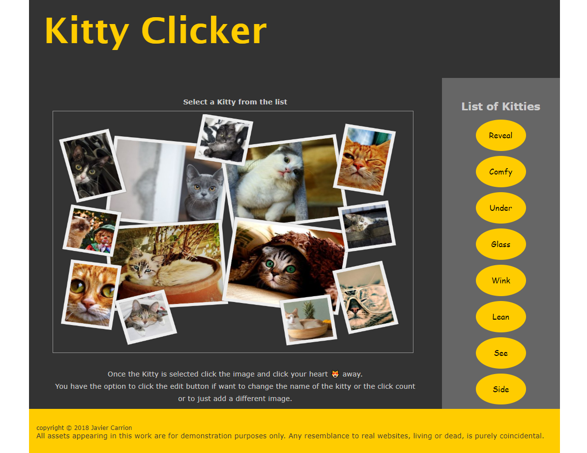

# Project Cat Clicker

### Table of Contents

- [Overview](#overview)
    - [Task](#task)
        - [Requirement 1](#requirement-1)
        - [Requirement 2](#requirement-2)
        - [Requirement 3](#requirement-3)
        - [Requirement 4](#requirement-4)
        - [Requirement 5](#requirement-5)
    - [Technologies Used](#technologies-used)
- [Project Instructions](#project-instructions)
    - [Demo](#demo)
- [Contact / Social Media](#contact--social-media)
    - [License](#license)

## Overview

Udacity Front-End Developer Nanodegree project that covers organizing the code using MVO design patters to separate areas of concerns without using a framework.
The application displays a picture of a kitty cat and a number of clicks. The project is divide into several branches showing the progression of changing requirements. The master branch has the latest requirement.

### Task

Created Cat Clicker application and refactored code base on the stakeholder requirements.

#### Requirement 1

Created an application that displays a picture of a cat and a number of clicks.
The number of clicks increment when the cat picture is clicked.

#### Requirement 2

Refactored the application to display two cats. Each cat includes the cat's name and the number of clicks increment individually for each cat.

#### Requirement 3

The Cat Clicker Premium application displays a list of cats. When a cat name is clicked in the list, the cat displays to show the data for the selected cat. The number of clicks in the cat area are unique to each cat, and will increment when the cat's picture is clicked.

#### Requirement 4

Refactored Cat Clicker Premium to add MVO design patterns to the project.

#### Requirement 5

The Cat Clicker Premium Pro application has an admin area for each cat displayed with inputs for changing the cat's name, url, and number of clicks (hidden by default). When the admin button is clicked, the admin area appears with the inputs filled in for the currently-selected cat. When the cancel button in the admin area is pressed, the admin area disappears. When the save button in the admin area is pressed, the currently-selected cat's values update with the values in the admin area.

### Technologies Used

* JavaScript
  * Using MVO design patters
* HTML5
* CSS3

## Project Instructions

To view the code and make changes:

1. Fork the repository.
2. Download the repository to your computer.
3. Locate the `index.html` file and open with an internet browser or favorite editor.

(Optional) A web server is not required to view the application, however  you wish to test with a local web server use the following node package http web server
Instructions (For local web server)

1. Install  node.js (npm will install as part of this installation)
2. Install http-server with the following command:

    `npm install http-server -g`

    This will install http-server globally so that it may be run from the command line.
3. run http-server in terminal inside the root of the cloned repo with the following command:

    `http-server`

4. Visit http://localhost:8080 to view the application

### Demo

[Kitty Clicker - MVO design patters last requirements](https://javavista.github.io/Project-Cat-Clicker/)

## Contact / Social Media

* Twitter – [@seetechnologic](https://twitter.com/seetechnologic)
* GitHub - [https://github.com/JavaVista/](https://github.com/JavaVista/)
* Personal Site - [Resume](http://www.techno-logic.us/)
* LinkedIn - [Javier Carrion](https://www.linkedin.com/in/technologic)

### License

Distributed under the MIT License. Note: Copyright and license text of third party modules are included in their source code.

See 
for more information.